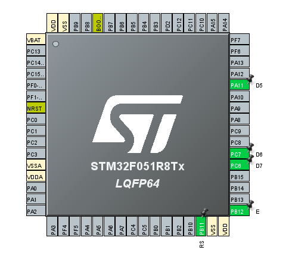
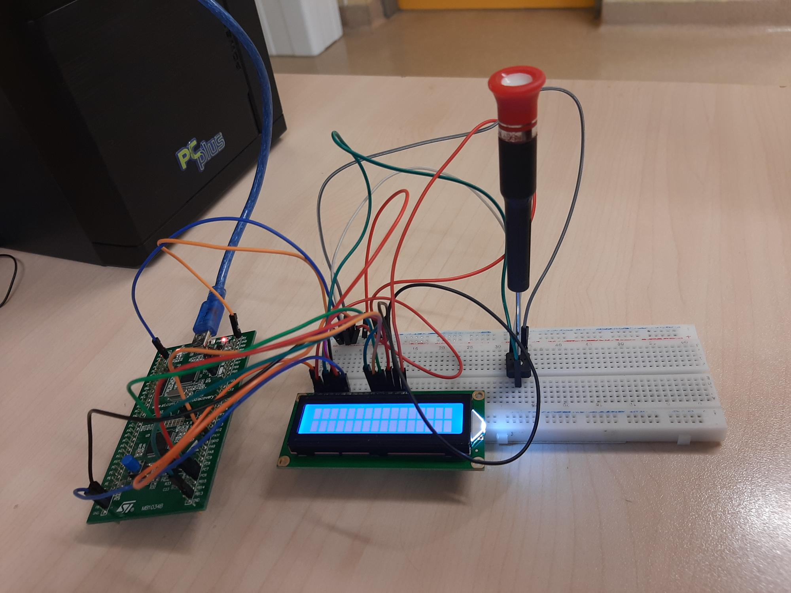

# Vaja-11---2x16-LCD-display

SLIKA PINOUT

SLIKA VEZJA

VPRAŠANJA IN ODGOVORI:

b) Za RS in E priključka na LCD zaslonu izberite in aktivirajte ustrezna pina __RS -> PB11__ in __E -> PB12__ kot GPIO_Output
(SAMO pini PB11, PB12, PB13, PA11, PC7 in PC6 so 5V tolerant). Pine tudi ustrezno preimenujte v RS in E 
(desni klik na pin in izberite Enter User Labe…l). Tudi za priključke D4 do D7 na LCD zaslonu aktivirajte 4
ustrezne pine __D4 -> PB11__, __D5 -> PA11__, __D6 -> PC7__ in __D7 -> PC6__ kot GPIO_Output. Pine tudi ustrezno preimenujte (od D4 do D7) v Pinout 
prikazu.

e)  V Clock Configuration spremenite frekvenco na vrednost, da bo polovica najvišje možne: Nova frekvenca 
bo __24__ MHz

f) V zavihku Pinout & Configuration pod rubriku System Core kliknite gumb GPIO. Kakšna je nastavljena 
hitrost podatkov na vodilih (max. output speed) ? __Low__.

h) Za __x__ MIN = 0, MAX = 15
   Za __y__ MIN = 0, MAX = 2

